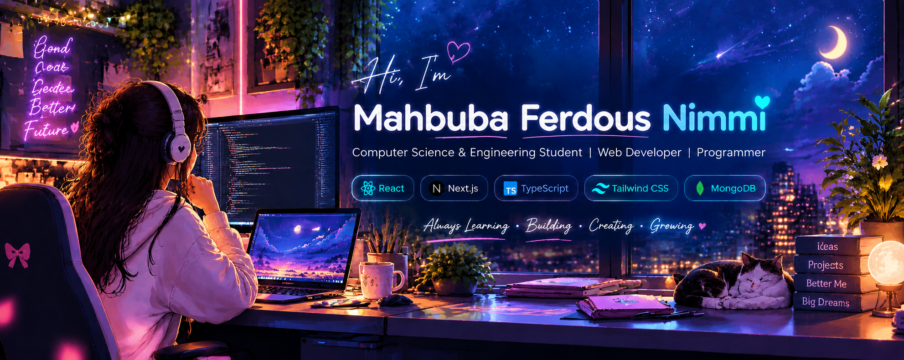

# 👋 Hi, I'm Mahbuba Ferdous Nimmi

CSE Student | Web Developer

## 👋 About Me

I'm a Computer Science and Engineering student interested in
programming and web development.

I enjoy learning new technologies and building useful
web applications.

## 🚀 Currently

- 🌱 Exploring React and Next.js
- 💻 Building responsive web applications
- 🌤️ Building a Weather App
- 📚 Improving my JavaScript skills
- 🧩 Practicing problem solving and programming

## 🛠️ Skills

### Languages

  

### Web Development

  

### Tools

  

## 🌐 Connect With Me

  

## 📊 GitHub Stats

